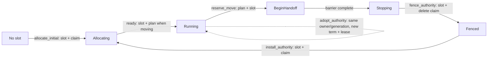

# lattice Architecture and Distributed-Correctness Review

> Status: corrected and revalidated on 2026-07-14
> Original review target: commit `9dbfca6` (2026-07-13)
> Revalidation target: commit `78c197f`; the relevant placement and remoting behavior is unchanged
> Scope: Coordinator leadership, placement persistence, handoff recovery, control delivery, bootstrap
> identity, operational durability, and storage bounds
> Verification: source audit plus the native, real-etcd, deterministic simulation/model, Docker
> quality/e2e/HA/chaos/k8s, 15-minute soak, and trace-replay gates recorded in the execution plan
> Companion documents: [architecture index](architecture/README.md),
> [production-hardening-plan.md](production-hardening-plan.md), and
> [cluster-discovery-lifecycle-plan.md](cluster-discovery-lifecycle-plan.md)
> Execution plan: [coordinator-correctness-implementation-plan.md](coordinator-correctness-implementation-plan.md)
> Implementation status (2026-07-14): F1-F6 are implemented and accepted in the current worktree.
> The detailed findings below remain the design/risk record for the pre-hard-switch baseline; exact
> commands, run IDs, seeds, traces, and artifacts are tracked in the execution plan.

---

## 0. Verdict

lattice has a strong distributed-systems foundation: exact-incarnation mTLS identity, lease-backed
leadership and claims, revisioned snapshots, bounded reliable control delivery, explicit authority
state machines, and shared production/simulation reducers.

The principal correctness risk in the reviewed baseline was narrower than the original review stated:

> **Coordinator mutations are record-CAS protected, but they are not storage-fenced by the current
> lease-backed leader record. Several placement transitions also span multiple records without an
> atomic commit.**

That produced two high-priority issues: a stale Coordinator could write after losing leadership, and
slot/claim recovery depends on later member activity in one authority-installation crash window.
The remaining confirmed issues concern durable admin semantics and bounded etcd state.

The original review also reported three remoting defects that are not present:

- redirected leader connections already bind the advertised identity to the peer certificate;
- `CoordinatorEvent` is used only for intentionally ephemeral, sequence-aware load telemetry;
- `AssociationId` already serves as the reconnect epoch and is regenerated with a new association.

### Risk summary

| ID | Finding | Severity | Disposition |
|---|---|---:|---|
| F1 | Placement writes did not prove that the writer still owned the leader lease | **High** | Implemented and accepted |
| F2 | Initial and replacement authority installation were not atomic slot-plus-claim commits | **High** | Implemented and accepted |
| F3 | Plan reservation/finalization and slot transitions were separate commits | **Medium** | Implemented and accepted |
| F4 | Admin idempotency and automatic-balance pause state were volatile | **Medium** | Implemented and accepted |
| F5 | etcd creation paths did not enforce the configured key domain/cardinality | **Medium** | Implemented and accepted |
| F6 | Unknown persisted member sessions delayed incarnation replacement until lease expiry | **Low** | Implemented as observable safe waiting and accepted |

Severity in this document measures impact under the documented fault model, not how difficult a fix
is. “High” means a leadership or crash boundary can violate a required safety/liveness invariant;
“Medium” means bounded operation or recovery semantics can fail; “Low” means a bounded availability
or operability limitation with a safe fallback.

---

## 1. Review method and invariants

The review followed persisted state across election, handoff, reconnect, and restart boundaries. A
finding is retained only when the current code supplies both a reachable state and an unmet
invariant. Hypothetical behavior from unused APIs is recorded as hardening advice, not as a defect.

The key invariants are:

1. **Leader authority** — every authoritative mutation commits only while the exact lease-backed
   `LeaderRecord` for that Coordinator term still exists.
2. **Single authority** — a new claim is installed only after the previous authority is drained or
   independently fenced; generation never moves backward.
3. **Atomic persisted state** — every committed state visible to recovery satisfies the slot/claim
   and slot/plan relationships required by its phase.
4. **Unambiguous state stream** — snapshot, delta, and acknowledgement identify the Coordinator term
   and the node-visible state revision to which they belong.
5. **Bounded recovery** — leader election alone is sufficient to discover and repair persisted
   transitional state; repair does not require an unrelated disconnect or admin command.
6. **Bounded storage** — attacker-controlled identifiers cannot grow the durable keyspace beyond a
   configured and recoverable limit.

---

## 2. Verified strengths

These mechanisms are sound and should remain intact during the redesign.

1. **Exact-incarnation mTLS identity.** `transport.rs:361-388` derives
   `spiffe://{cluster}/node/{node_id}/{incarnation:032x}` and requires that exact URI SAN. Outbound
   established connections verify the expected `NodeIdentity`, including redirected leaders.
2. **Association-free bootstrap probes.** `bootstrap.rs:162-195` validates a fresh request nonce and
   transport compatibility. `endpoint.rs:237-316` uses a temporary connection and does not create an
   `Association` during probing.
3. **Atomic leader election.** `storage/etcd.rs:149-200` atomically requires an absent leader key and
   the expected term revision, then writes the incremented term and lease-backed leader record.
4. **Monotonic claim replacement.** `storage/etcd.rs:284-299` prevents an existing higher generation,
   conflicting owner, higher term, or higher grant sequence from being overwritten by an older
   grant. This protects the single etcd claim record; local authority still depends on grant TTL and
   the handoff protocol.
5. **Bounded, separated transport lanes.** Control, interactive, and striped bulk lanes have bounded
   queues and byte budgets. Admission uses `try_send`, so backpressure does not silently become an
   unbounded waiter population.
6. **Reliable state-bearing control.** `control.rs` provides an association epoch, monotonically
   sequenced envelopes, cumulative acknowledgement, bounded replay, gap reconciliation, and bounded
   command-ID deduplication.
7. **Strict snapshot/delta installation.** `coordinator.rs:415-469` installs snapshots atomically and
   accepts only the next node-visible revision. A gap makes the session unready and requires a new
   snapshot.
8. **Shared state-machine core.** Authority and handoff reducers are pure transition functions used
   by both runtime code and `lattice-sim`.
9. **Feature-gated failpoints.** Production builds retain named boundaries but not active fault
   injection.

---

## 3. Confirmed findings

### 3.1 F1 — authoritative writes are not guarded by the live leader record — HIGH

Leader election is safe, but subsequent writes prove only their record-local preconditions:

- `compare_and_put_slot` reads a slot and compares its etcd `mod_revision`
  (`storage/etcd.rs:465-481`);
- member and plan mutations use the same read-then-single-key-CAS pattern;
- `coordinator_term` is persisted in slots and claims, but slot/member/plan transactions do not
  compare the store's current term or leader key;
- the run loop discovers leadership loss only when `keep_lease_alive` fails on a renewal tick
  (`runtime/lifecycle.rs:225-278`).

A reachable sequence is:

1. Coordinator L1 holds term T and its leader lease expires during a pause or network fault.
2. etcd removes the lease-backed leader key.
3. Before L1 observes renewal failure, L1 handles a queued control/admin operation.
4. The record-local CAS can succeed because it does not require the leader key to exist.
5. A successor may concurrently campaign for T+1; writes to different records do not conflict.

Comparing only `coordinator/term == T` is insufficient: after L1's lease expires and before a
successor campaigns, the persistent term key still contains T. Every authoritative write must also
compare the lease-backed leader key with L1's exact `LeaderRecord`. An absent leader key must make
the transaction fail even if the term key has not yet advanced.

**Required fix:** introduce a `LeaderGuard` applied inside every Coordinator mutation transaction:

```text
leader key exists and value == encoded LeaderRecord(node, protocol_generation, term)
AND term key value == term
AND record-specific preconditions
```

The in-memory store must check the same condition while holding its single state mutex. A guard
failure is `LeadershipLost`, not a generic record conflict or backend outage, and terminates the
leader runtime immediately.

### 3.2 F2 — authority installation is not an atomic slot-plus-claim commit — HIGH

Initial allocation has the simplest instance of the problem. `persist_initial_allocation` writes and
publishes an `Allocating` slot, then grants a lease and writes its claim
(`runtime/allocation.rs:198-239`). If execution stops between the slot and claim writes, the slot is
durable but no claim or grant exists. Election recovery does not actively repair an initial
`Allocating` slot; later member registration normally reaches `reconcile_claims_for` and masks the
gap.

`replace_authority` (`runtime/rebalance.rs:330-449`) performs these durable actions separately:

1. verify and delete the old claim;
2. persist `Stopping/StopFailed -> Fenced`;
3. persist `Fenced -> Allocating(target, next_generation)`;
4. grant a new lease;
5. write the new claim;
6. send `ClaimGranted`.

If execution stops after step 3 but before step 5, persisted state contains an `Allocating` slot for
the target generation with no matching claim. Recovery reconstructs that handoff in `Starting`
(`handoff.rs:104-137`). `HandoffMachine::start()` emits work only from `Invalidating`, so election
recovery does not recreate the claim (`runtime/lifecycle.rs:172-197`).

`reconcile_claims_for` can repair the state, but it runs while a member becomes `Up`
(`runtime/membership.rs:485-515, 908-962`). A normal reconnect therefore often masks the problem;
the persisted state is nevertheless not self-healing from election alone, and a still-live session
does not provide a bounded recovery trigger.

This is an availability defect, not evidence of two simultaneously valid etcd claim records.

**Required fix:** create an `allocate_initial` transaction that atomically creates the first
`Allocating` slot and its generation-1 claim. For replacement, preserve `Fenced` as an observable
phase, but make target installation one atomic domain transaction:

```text
pre-grant target lease
TXN WHEN leader_guard
      AND slot == expected Fenced state
      AND claim key is absent
    THEN put slot = Allocating(target, next_generation, next_state_version)
      AND put claim(target, next_generation, term, sequence=1) with target lease
```

If the transaction fails, revoke the unused target lease. If the commit succeeds but sending
`ClaimGranted` fails, election/periodic reconciliation resends the already committed grant.

### 3.3 F3 — plan/slot state changes lack a shared commit boundary — MEDIUM

`begin_move` persists the plan's movement as `Handoff` before CAS-ing the slot to `BeginHandoff`
(`runtime/rebalance.rs:100-141`). This order is deliberate write-ahead recovery: if the process dies
after the plan commit, `recover_persisted_plans` can resume a still-valid move from a `Running` slot.

The weakness is not “plan first” by itself. It is that a compare failure, leadership race, or
unknown RPC outcome can leave plan and slot records describing different reservations until a later
recovery pass. In the current term, the persisted plan may also differ from `self.plans` because the
in-memory map is updated only after the slot write.

Reversing the writes is not safe: a slot containing `active_move = plan_id` without a durable plan
has a worse recovery path. The correct fix is one transaction that compares and updates the plan,
slot, node-visible state revision, and leader guard together. Completion should likewise update the
slot and plan movement in one commit.

### 3.4 F4 — admin retry and pause semantics do not survive leader failover — MEDIUM

`automatic_globally_paused`, `paused_entity_types`, and `applied_admin_operations` are initialized
empty for every elected leader (`runtime/mod.rs:365-367, 431-456`). Therefore:

- an automatic-balancing pause silently disappears on failover;
- an operation ID can be reused after failover without detecting a different fingerprint;
- a retried relocation cannot reliably return its original plan ID, even when the public operation
  contract declares it idempotent.

A retry will sometimes fail a later generation/state check instead of creating duplicate work, but
that is not equivalent to durable idempotency.

**Required fix:** persist Coordinator settings and bounded operation records. Creating an operation
record and its result-producing mutation must share one leader-guarded transaction. The API must
document the idempotency retention window after terminal records are compacted.

### 3.5 F5 — durable key creation is not bounded by the etcd backend — MEDIUM

The in-memory store enforces `maximum_slots` and `maximum_plans` (`storage.rs:344-385`). The etcd
backend accepts new slot and plan keys without an equivalent creation bound
(`storage/etcd.rs:465-510`). `maximum_list_records` limits reads, not writes. Once the durable
keyspace exceeds it, election, snapshots, inspection, and recovery can fail with `Capacity`.

The allocation path also accepts a wire `ShardId` without checking it against the registered entity
configuration's `shard_count` before constructing a key (`runtime/allocation.rs:10-33`). An
authenticated subscribed node can therefore request durable keys outside the legitimate shard
domain.

**Required fix:**

- reject `shard_id >= entity_config.shard_count` before any store access;
- bound registered entity/singleton configuration counts;
- distinguish list page size from total durable cardinality;
- enforce new-key counters or an equivalent leader-guarded cardinality predicate in the same
  transaction that creates/deletes a slot or plan;
- paginate bounded recovery reads instead of turning a page-size threshold into an unrecoverable
  cluster state.

### 3.6 F6 — safe incarnation replacement may wait for the old lease — LOW

After election, `sessions` is empty even though lease-backed member records may still exist. When a
node with the same `node_id` and a new incarnation registers, replacement is accepted only if the
old in-memory session is known and heartbeat-expired (`runtime/membership.rs:320-337`). With no
session evidence, registration returns `StaleMember` until etcd removes the old member record.

The delay is bounded by the old lease's **remaining** TTL, not necessarily a full configured TTL.
It is a safe default: possession of a new certificate/incarnation does not prove the old process has
stopped. Treat this as a retryable `IncarnationPending` state with lease/owner diagnostics. Faster
replacement requires independent fencing proof, an authenticated graceful-supersession token, or an
operator force-remove; it must not be enabled merely because the new incarnation number is higher.

---

## 4. Corrections to the original review

The following original findings should not drive implementation work.

| Original claim | Corrected assessment |
|---|---|
| C3: plan revisions break the global barrier revision | Plan `revision` is a per-plan CAS/version field. Plans are not installed in node routing snapshots. It must remain separate from the node-visible member/slot state stream. Revision collision during overlapping leadership is a consequence of F1; term-qualifying the state stream is useful defense-in-depth. |
| C4: redirect targets are not certificate-bound | False under configured mTLS. `establish_coordinator` passes the advertised leader identity to `connect_peer` (`cluster/join.rs:279-307`), and `open_outbound_lane` calls `connect_tls` with that exact expected identity (`remoting/endpoint.rs:425-479`). A Byzantine member can induce failed dials or limited network probing, but cannot impersonate the leader certificate. |
| C5: `CoordinatorEvent` creates non-idempotent control side effects | False for current callers. `admit_ephemeral_control` is used only by `NodeLoadReport` and `ShardLoadReport` (`placement/session.rs:175-186, 215-224`). Both carry monotonically checked sample sequences (`coordinator.rs:487-568`) and are intentionally lossy. Keep the API typed/restricted so future state-bearing commands cannot enter this path. |
| C7: the reliable-control epoch is never reset or persisted | False. `AssociationId` is the epoch. It is intentionally stable across lane reconnect so the bounded outbox can replay, and `AssociationManager` generates a fresh ID for a new outbound association (`association.rs:518-562`). A process restart also uses a new node incarnation. `reset_epoch` need not be called during an ordinary lane reconnect. |
| C10: persisting the plan before the slot is inherently wrong | Incomplete. Plan-first ordering is a recoverable write-ahead convention. The defect is the missing atomic plan/slot commit. Writing the slot first without a transaction is unsafe. This concern is retained as F3. |
| `map_etcd` collapses `CompareFailed` into `Unavailable` | Inaccurate. A failed etcd transaction predicate returns a successful RPC with `succeeded() == false`, which callers map to `CompareFailed`. `map_etcd` does collapse all **etcd client/RPC errors** to `Unavailable`, so error taxonomy and observability can still improve. |

The redirect path can optionally constrain dialable address ranges if authenticated members are in a
Byzantine/SSRF threat model, but that is separate from certificate identity binding and is not a
high-severity authentication defect.

---

## 5. Recommended target design

### 5.1 Give each ordering concept one explicit purpose

Several numeric fields currently look interchangeable even though they protect different
boundaries. Preserve the distinctions in types and APIs:

| Concept | Scope | Purpose |
|---|---|---|
| `CoordinatorTerm` | Cluster leadership | Election epoch and stale-leader fence |
| lease-backed `LeaderRecord` | Current live leader | Proves the term owner still holds leadership now |
| etcd `mod_revision` | One stored key | Optimistic concurrency for the exact record read |
| `StateVersion { term, revision }` | Node-visible member/slot stream | Snapshot/delta ordering and barrier acknowledgement |
| plan record revision | One rebalance plan | CAS for plan progress; never part of the node routing stream |
| `AssignmentGeneration` | One placement slot | Prevents old owner/activation authority from returning |
| `GrantSequence` | One slot generation and owner | Orders claim renewal/grant updates |
| `AssociationId` + control sequence | One peer association | Reconnect replay, deduplication, and gap detection |

Add the Coordinator term to snapshots, deltas, member events, and `AppliedRevision`. A node must
install a snapshot for a new term before accepting that term's deltas. Acknowledgements from an older
term can then never satisfy a current handoff barrier.

Maintain a durable `coordinator/state_revision` counter for node-visible member/slot mutations. Read
its value, compare its exact revision/value, and write the next value inside the same guarded
transaction as the state mutation. Plan-only progress does not consume this counter.

### 5.2 Prefer domain transactions over a generic public transaction language

A raw `txn(Predicate, Op)` method would expose etcd concepts throughout the Coordinator and make it
easy for a new call site to omit a leader predicate. Put the invariants in named store operations
instead:

```text
reserve_move(leader_guard, expected_plan, next_plan,
             expected_slot, begin_handoff_slot, next_state_version)

allocate_initial(leader_guard, expected_slot_absent, allocating_slot,
                 leased_claim, next_state_version)

adopt_authority(leader_guard, expected_slot, expected_prior_term_claim,
                same_owner_generation_slot, replacement_leased_claim,
                next_state_version)

fence_authority(leader_guard, expected_slot, expected_old_claim_or_absence,
                fenced_slot, next_state_version)

install_authority(leader_guard, expected_fenced_slot, expected_claim_absent,
                  allocating_slot, leased_claim, next_state_version)

complete_move(leader_guard, expected_allocating_slot, running_slot,
              expected_plan, completed_plan, next_state_version)

put_member(leader_guard, expected_member, next_member, next_state_version)

apply_admin_operation(leader_guard, operation_id, fingerprint,
                      expected_settings_or_plan_state, mutation, durable_result)
```

Every etcd implementation method builds exactly one `Txn` containing:

1. exact leader-record and term comparisons;
2. exact record/mod-revision comparisons for every input record;
3. the state-revision counter comparison when node-visible state changes;
4. every related write/delete in the `then` branch.

The in-memory implementation performs the same operation under one mutex. The simulator should
model these domain commits directly, including an all-or-nothing outcome, rather than simulating a
sequence of single-key RPCs that production no longer exposes.

### 5.3 Make the persisted handoff graph valid at every commit

The forward-only handoff remains:



Every edge that names multiple records is one leader-guarded etcd transaction, not a sequence of
independently successful writes.

| Phase | Atomic persisted transition | External effect after commit |
|---|---|---|
| Initial allocation | create generation-1 `Allocating` slot + matching claim | publish delta and send/replay `ClaimGranted` |
| New-leader adoption | update a matching slot and same-owner/generation claim to the new term/lease/sequence | publish term-qualified delta and send/replay the adopted grant after session recovery |
| Reserve | plan `Pending -> Handoff` + slot `Running -> BeginHandoff` | publish invalidating delta |
| Drain | slot `BeginHandoff -> Stopping` | send/replay `DrainSlot` |
| Fence | delete exact old claim (or prove it absent) + slot `Stopping/StopFailed -> Fenced` | publish fenced delta; revoke old lease as cleanup |
| Install | slot `Fenced -> Allocating` + put exact-generation target claim on pre-granted lease | publish delta and send/replay `ClaimGranted` |
| Activate | slot `Allocating -> Running` + plan movement `Handoff -> Completed` | publish active delta and compact eligible plans |

Lease grant/revoke RPCs cannot be part of an etcd key transaction. Treat them as resource setup and
cleanup:

- grant the new lease before `allocate_initial` or `install_authority`;
- use the same setup/cleanup rule when a new leader adopts an existing owner/generation into its term;
- attach the claim key to it inside the transaction;
- revoke it if the transaction loses its compare;
- delete the old claim atomically with fencing, then revoke its old lease best-effort.

At no committed boundary may `Allocating` or `Running` exist without a matching owner/generation
claim. `Fenced` is the explicit recoverable state between authorities.

### 5.4 Reconciliation is the liveness safety net, not the primary commit protocol

Run the same bounded, idempotent reconciler:

- immediately after election and before accepting mutation traffic;
- after a member becomes `Up`;
- periodically at a configurable, jittered cadence;
- after a compare/unknown-outcome error once leadership has been revalidated.

It should page through indexed transitional records and enforce:

- a matching older-term claim is adopted into the current term and a leader-owned lease without
  changing slot owner or assignment generation;
- `BeginHandoff/Stopping` has a recoverable plan and resends the required drain effect;
- `Fenced` installs the target authority using the atomic transaction;
- `Allocating` has an exact matching claim and resends `ClaimGranted`;
- `Running` has an exact matching live claim; a missing claim enters the fenced recovery path rather
  than granting authority to a different owner without proof;
- `active_move` points to a compatible nonterminal plan movement;
- terminal plan/slot disagreement is finalized idempotently;
- claims for nonexistent, older-generation, or different-owner slots are revoked/quarantined.

Do not require a full unbounded cluster scan every tick. Maintain phase indexes or bounded pages, cap
work per pass, expose backlog/oldest-age metrics, and continue from a durable or in-memory cursor.

### 5.5 Persist admin state and define its retention contract

Use durable records such as:

```text
coordinator/settings/automatic
  global_paused
  paused_entity_types
  record_revision

coordinator/admin-operations/{operation_id}
  fingerprint
  status
  result (including plan_id when applicable)
  coordinator_term
  created_state_version
```

Pause/resume writes its setting and idempotency result atomically. Manual relocation creates its plan
and operation result atomically; later execution is driven from the durable plan. Reusing an ID with
another fingerprint remains a conflict after failover.

Bound terminal operation history by count and/or age. Compaction must be revision-conditional, and
the public API must state that an operation ID is guaranteed idempotent only for the configured
retention window.

### 5.6 Make durable bounds explicit and recoverable

Use separate limits for:

- list page size;
- total slots;
- active plans and retained terminal plans;
- member/configuration records;
- retained admin operations;
- reconciliation work per pass.

Validate the logical key domain before persistence. For shards, the authoritative entity config
must exist and `shard_id < shard_count`. For new durable keys, update a counter/index in the same
leader-guarded transaction as creation/deletion, or use an equivalently atomic bounded index.

Startup should verify/rebuild counters from bounded pages and fail with a diagnostic repair mode if
external mutation made them inconsistent. It should not become permanently unable to list the keys
needed to repair the inconsistency.

### 5.7 Keep member supersession safe and make waiting observable

When an elected leader sees a persisted member but has no session evidence, return a retryable result
that includes the old incarnation and, where available, remaining lease TTL. The joining node backs
off and retries. Optional acceleration paths are:

- graceful restart token issued/fenced by the old incarnation;
- proof that the old member lease/key is absent in the replacement transaction;
- authenticated operator force-remove.

Never infer that a numerically newer incarnation alone invalidates a still-leased predecessor.

### 5.8 Treat the redesign as a schema and protocol boundary

The transaction semantics, durable counters/settings, and term-qualified state stream are not a
mixed-version change. Roll them out as an explicit compatibility boundary:

- bump `STORAGE_SCHEMA_GENERATION` and refuse a new Coordinator against the old layout;
- bump the placement control protocol generation for term-qualified snapshot/delta/ack messages;
- initialize `coordinator/state_revision` from the maximum persisted member/slot revision;
- initialize slot/plan/admin cardinality indexes from bounded, paged scans;
- initialize durable automatic-balance settings explicitly rather than relying on constructor
  defaults;
- quarantine and reconcile legacy transitional states before mutation traffic is enabled.

The migration should be an offline or single-leader operation with a backup/export and a dry-run
report. Do not attempt a rolling mixed cluster in which old writers can bypass the new leader guard.

---

## 6. Verification plan

### 6.1 Store contract tests

Run the same tests against the in-memory and real etcd implementations:

- every mutation fails with `LeadershipLost` after the leader key is deleted, even before the term
  key advances;
- every mutation from term T fails after term T+1 campaigns;
- a failed multi-record compare writes none of its records or state-revision counter;
- slot/claim and slot/plan commits are all-or-nothing;
- losing a pre-granted lease race leaves no claim and the lease is revoked;
- new-key limits remain exact under retries and unknown-outcome reconciliation.

### 6.2 Failpoint and process tests

Add boundaries around:

- lease grant before authority installation;
- atomic authority commit before delta/send;
- move reservation commit before delta;
- active-slot/plan completion commit before delta;
- admin operation commit before response;
- leader lease expiry immediately before every mutation family.

For each boundary, kill/pause the process, elect a new leader, and assert recovery without requiring
the target member to disconnect. Include the specific legacy state `Allocating(target generation),
claim absent` to verify migration/reconciliation.

### 6.3 Simulator invariants

Check after every atomic transition:

```text
mutation_committed => exact_leader_guard_was_true_at_commit

slot in {Allocating, Running}
  => claim exists
  && claim.owner == slot.owner
  && claim.assignment_generation == slot.assignment_generation

slot.active_move == plan_id
  => plan contains a compatible nonterminal movement for the slot

AppliedRevision(term, revision) satisfies a barrier
  => acknowledgement.term == barrier.term
  && acknowledgement.revision >= barrier.revision
```

Liveness checks begin only after a declared stable period with one live leader, available etcd, and
eligible members. Under those conditions, every persisted transitional slot must reach `Running` or
a visible terminal failure within a bounded number of reconciliation passes.

---

## 7. Implementation order

1. **Schema boundary and leader-guarded mutation contract (F1).** Add `LeadershipLost`, exact
   leader/term predicates, the new durable metadata, and parity tests for memory/etcd/simulation.
2. **Atomic authority and plan transitions (F2, F3).** Introduce domain transactions and preserve the
   explicit `Fenced` phase.
3. **Term-qualified state stream.** Add `StateVersion { term, revision }` to snapshots, deltas,
   member events, and acknowledgements; keep plan record versions separate.
4. **Election and periodic reconciliation.** Repair/resend from persisted phase without relying on
   member re-registration.
5. **Durable admin operations/settings (F4).** Define and enforce retention semantics.
6. **Key-domain and cardinality bounds (F5).** Add shard-range validation, atomic counters/indexes,
   and paged recovery.
7. **Member replacement UX and operability (F6).** Preserve lease safety while exposing retry state.
8. **Observability cleanup.** Surface per-connection task failures, distinguish etcd error classes,
   and publish reconciliation backlog/leadership-loss metrics.

The first two steps are the correctness boundary. Later work should build on their guarded,
all-or-nothing store API rather than add more recovery branches around single-key writes.

---

## 8. Lower-priority engineering notes

- `accept_loop` currently discards the inner per-connection result (`remoting/endpoint.rs:513-516`).
  Record a bounded metric/log by error class; do not let noisy peers create unbounded log volume.
- Exact inbound certificate-to-node matching occurs after the peer supplies its handshake identity.
  That is necessary for the comparison and is not an authentication bypass. An earlier syntactic
  SPIFFE/cluster check may reduce work from a trusted-but-wrong certificate but is only DoS hardening.
- `map_etcd` should preserve useful RPC categories such as authentication, invalid argument,
  deadline, and transport unavailability. Transaction predicate failure is already handled
  separately as `CompareFailed`.
- `Association::state()` followed by queue admission is not one lock operation. The queue remains
  bounded and admission rechecks active state, so this is not currently a correctness finding.
- Replaced duplicate lane tasks should emit lifecycle metrics so a persistent duplicate-connection
  pattern is diagnosable even though nonce arbitration prevents two authoritative attachments.

---

## 9. Original finding mapping

| Original ID | Final disposition |
|---|---|
| C1 | Retained and corrected as F2 |
| C2 | Retained and strengthened as F1 |
| C3 | Folded into F1 plus term-qualified state-stream design; plan-counter claim rejected |
| C4 | Rejected: redirected established dial already performs exact certificate binding |
| C5 | Rejected for current callers: path is intentional sequence-aware telemetry |
| C6 | Retained as F4 |
| C7 | Rejected: `AssociationId` already provides the intended epoch lifecycle |
| C8 | Retained with lower severity and safe-replacement constraints as F6 |
| C9 | Retained and expanded with shard-domain validation as F5 |
| C10 | Reframed as the atomic plan/slot issue F3; unsafe write-order reversal removed |
