# 00. Overview and Boundaries

> Target architecture for lattice's actor runtime, remoting, sharding, and singleton model.
> Back to: [architecture index](README.md)

---

## 0. Design Conclusion

lattice is a distributed actor service framework inspired by Akka/Pekko Cluster Sharding, Cluster Singleton, Remoting, DeathWatch, `tell`, and `ask`, with a deliberately smaller control plane.

```text
Concrete actor:  ActorRef<A>     -> exact node incarnation / actor path / activation
Sharded entity:  EntityRef<A>    -> local ShardRegion -> shard owner -> entity
Singleton:       SingletonRef<A> -> local SingletonProxy -> current singleton owner

All cross-node messages
  -> lattice-remoting association
  -> framed TCP, optionally TLS

Control plane
  -> Coordinator leader
  -> independent etcd
```

The framework has one internal transport model. It does not expose gRPC or Direct Link as parallel business APIs. Business code exchanges typed messages through actor references; remoting serializes those messages and manages node associations internally.

Unlike Akka/Pekko Cluster, lattice does not use Gossip. Coordinator leadership, membership, shard ownership, claims, and singleton ownership are stored in independent etcd. Normal actor messages never pass through etcd or the Coordinator.

### 0.1 Why Direct Link Disappears

Direct Link previously compensated for the overhead and request/reply shape of the gRPC data path. Once gRPC is removed, `lattice-remoting` itself is the persistent framed TCP/TLS transport, so a second link/session/stream abstraction would duplicate connections, identity, codecs, backpressure, lifecycle, and observability.

```text
old:
  command/response -> gRPC
  high-throughput tell -> business-managed Direct Link

target:
  tell/ask/watch/control -> one lattice-remoting association
  high-throughput tell   -> the same association's bounded bulk lane
```

The implementation reuses suitable Direct Link internals—framing, pooling, stripes, heartbeat, reconnect, backpressure, and benchmarks—but removes public link opening, named streams, link sessions, `Linked<M>`, `LinkOpened`, manual endpoints, and business-managed reconnect. Bulk delivery is an internal scheduling/transport policy, not another reference or delivery model.

## 1. Goals and Non-Goals

### 1.1 Goals

1. One authoritative owner for each mutable actor state.
2. Typed Rust messages and `Handler<M>` business code.
3. Serializable references to any live user actor or child actor.
4. Stable logical references to sharded entities and cluster singletons.
5. Akka-style `tell`, `ask`, and DeathWatch semantics over one remoting runtime.
6. Bounded buffering, explicit deadlines, backpressure, and observable failure modes.
7. Coordinator-driven placement and failover without a Coordinator hop on known data-plane routes.
8. Kubernetes-friendly startup, drain, shutdown, and rolling replacement.
9. Capacity/load-aware, bounded, explainable shard allocation and rebalancing that reuses the same fenced handoff path.

### 1.2 Non-Goals

```text
No framework-owned gRPC transport.
No public Direct Link business API.
No Gossip membership protocol.
No persistent actors, event sourcing, remembered entities, or Akka Streams equivalent.
No remote actor deployment or wildcard ActorSelection.
No transparent exactly-once delivery.
No cross-machine per-frame realtime simulation in the first version.
No etcd lookup per actor message.
No separate high-throughput Direct Link or stream transport for actor messages.
```

## 2. Reference and Runtime Terminology

| Term | Meaning |
|---|---|
| `ActorPath` | Stable hierarchical path within one actor system, such as `/user/session/42/worker` |
| `ActivationId` | Unique identity of one concrete actor lifetime; prevents a stale path from addressing a replacement |
| `ActorRef<A>` | Serializable reference to one exact live actor activation on one node incarnation |
| `EntityRef<A>` | Logical reference to a sharded entity, independent of its current activation and owner node |
| `SingletonRef<A>` | Logical reference to one fixed singleton kind through a local proxy |
| `NodeIncarnation` | Identity of one process lifetime at a node address |
| `ProtocolId` | Explicit stable `u64` identifying one actor protocol independently of Rust type names |
| `ProtocolFingerprint` | BLAKE3 digest of the canonical protocol/message/codec/schema descriptor negotiated per ProtocolId after Association establishment |
| `EntityId` | Maximum 256-byte canonical business-key encoding used by EntityRef and shard hashing |
| Association | One logical peer relationship between two exact node incarnations, owning a fixed bounded group of TCP/TLS lane connections |
| ShardRegion | Per-node routing and buffering component for one sharded entity type |
| Shard | Placement unit containing many logical entities |
| Coordinator | Elected control-plane actor assigning shards and singletons |
| Claim | Lease-backed right to serve a shard or singleton generation |
| Allocation strategy | Pure Coordinator-side policy that proposes initial owners and bounded shard moves from one immutable placement view |
| RebalancePlan | Persisted, term/revision/policy-fenced set of generation-conditional shard moves executed through normal handoff |
| DeathWatch | Lifecycle notification bound to one exact actor activation; logical refs expose resolve-without-activate `watch_current` |
| EventBus | Pub/sub for broadcast and asynchronous integration; not point-to-point actor routing |

## 3. Whole-System Logical View

### 3.1 Topology

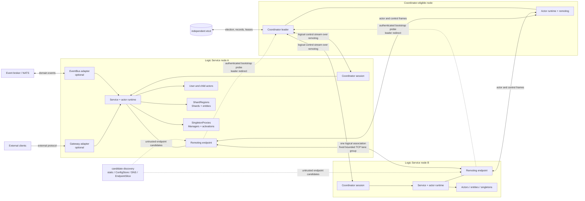

There is one internal network protocol: `lattice-remoting`. Business actor messages, Coordinator control messages, DeathWatch, heartbeat, and shutdown control use different frame kinds or lanes over the same association runtime.

One active node pair owns one logical Association, not one connection per actor or request. Its initial physical layout is:

```text
Association(local NodeIncarnation, remote NodeIncarnation)
  control TCP/TLS connection:      exactly 1
  interactive TCP/TLS connection:  exactly 1
  bulk TCP/TLS stripes:            1 by default, configurable 1..4 after benchmarking
```

All connections share Association identity, protocol negotiation, authorization, lifecycle, metrics, and closing. They use separate bounded queues and socket-owner tasks so bulk writes cannot head-of-line block heartbeat, DeathWatch, Coordinator control, asks, or replies. The group is created lazily per communicating node pair and is not a business-visible connection pool.

The control connection carries one Association-scoped reliable control stream. Commands that must survive reconnect use sequence numbers, cumulative acknowledgements, a bounded replay outbox, and idempotent application. DeathWatch, Coordinator state, claims, handoff, drain, and Singleton control reuse this mechanism; tell/ask business frames do not.

Only Coordinator-eligible nodes receive general placement etcd credentials and watches. Ordinary nodes may read the minimal leader bootstrap record, then all control traffic moves to remoting. etcd is not connected to actor mailboxes, ShardRegion hot paths, Gateway forwarding, or EventBus delivery.

### 3.2 Roles a Logic Service May Carry

Roles are capabilities, not mutually exclusive process types. One `LatticeService` process may carry several roles, although production deployments should keep credentials and failure domains narrow.

| Role | Responsibility | Required state/access |
|---|---|---|
| Base runtime | Actor system, protocol registry, mailboxes, supervision, remoting, Coordinator session | Required on every lattice node |
| Gateway | External connections, authentication, decode/encode, rate limits, recipient selection | Optional; no placement write access |
| Concrete actor host | User guardian and arbitrary user/child actor paths | Local registry only |
| Shard proxy | Creates `EntityRef`, hashes entity IDs, caches homes, forwards and buffers | Automatically present for each used entity type |
| Shard host | Owns Shard tasks and activates entities for eligible entity types | Role/capacity eligibility plus valid shard claims |
| Singleton proxy | Resolves `SingletonRef` and buffers briefly during failover | Present where a singleton is called |
| Singleton host | Runs SingletonManager and singleton activation | Role eligibility plus valid singleton claim |
| Coordinator eligible | Participates in leader election and may become Coordinator leader | The only role with placement etcd credentials |
| Event subscriber | Converts typed broker events into service work or actor messages | Optional broker connection |
| Ops endpoint | Health, readiness, metrics, inspection, drain/admin adapter | Optional external HTTP adapter |

Recommended deployment shapes:

```text
dedicated Coordinator nodes:
  base runtime + Coordinator eligible + ops

normal logic nodes:
  base runtime + concrete actor host + selected shard/singleton host roles + optional EventBus

Gateway nodes:
  base runtime + Gateway + shard/singleton proxies + session actors; normally no entity ownership
```

The framework may implement an internal role as an actor or as another supervised runtime component. That implementation choice must not change its message, lifecycle, ownership, or backpressure contract.

### 3.3 Components Inside One Logic Service

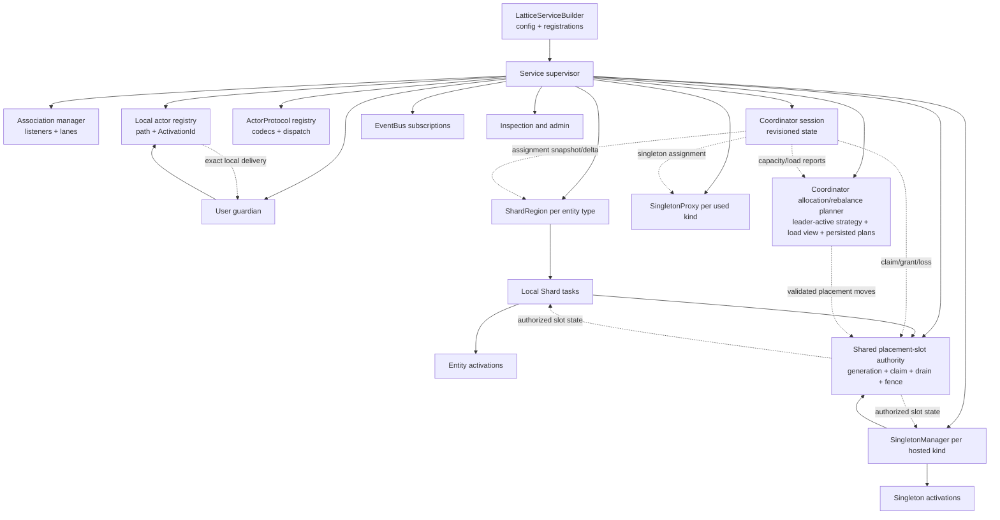

The service supervisor owns every long-lived component and join handle. The allocation/rebalance planner is instantiated only for Coordinator-eligible service roles and becomes active only on the reconciled leader. No association, Region, claim renewal, subscription, scheduler, or actor task is detached from service shutdown.

## 4. Message Flow

### 4.1 Recipient Routing

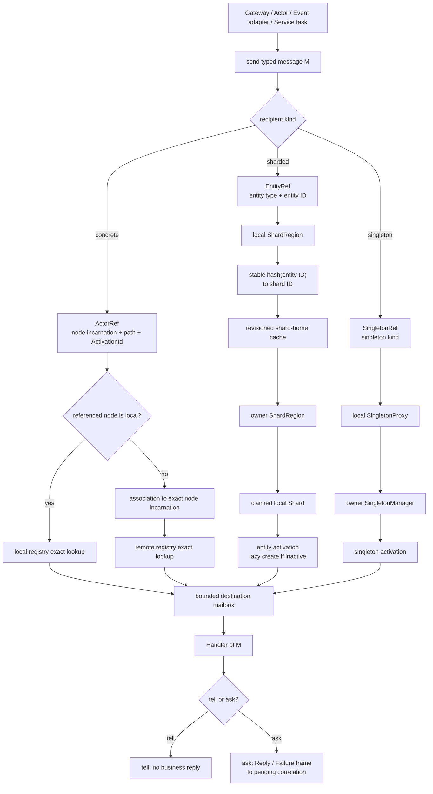

Routing rules:

1. Concrete `ActorRef` goes directly to the named node incarnation and exact activation; it never enters ShardRegion or Coordinator.
2. `EntityRef` always enters the caller's local ShardRegion. The Region derives `shard_id` from the `entity_id`; it never extracts routing identity from the business payload.
3. `SingletonRef` always enters the caller's local SingletonProxy.
4. Local and remote delivery converge on the same bounded mailbox and `Handler<M>`.
5. Known entity/singleton homes use only cached Coordinator state and direct remoting; they do not query etcd or hop through Coordinator.

### 4.2 Tell, Ask, Watch, and Event Delivery

| Message family | Path | Completion meaning |
|---|---|---|
| Tell | recipient router → optional remoting → mailbox | Caller completes after bounded local admission; no Handler result returns |
| Ask | Tell path plus correlation/deadline → Reply or Failure frame | Caller receives typed reply, typed failure, timeout, or `UnknownResult` |
| Watch | exact ActorRef via registry/control lane; EntityRef/SingletonRef first resolve current activation without creating it | Produces `Terminated` for that activation; replacement requires a new watch |
| Coordinator control | Coordinator session over the reliable remoting control stream | Revisioned snapshot/delta/ack, allocation, handoff, claim, drain; reconnect replays or reconciles bounded state |
| EventBus event | broker subscription → typed adapter → optional recipient send | Broker guarantee plus business idempotency; never an implicit ask |
| Scheduler message | managed timer → recipient send | Uses the recipient semantics at trigger time |

Tell and ask are protocol modes registered by `ActorProtocol`. A tell message has `Reply = ()`; an ask message has a registered reply codec, which may also encode `()` when handler-completion acknowledgement is desired.

### 4.3 Coordinator State Distribution

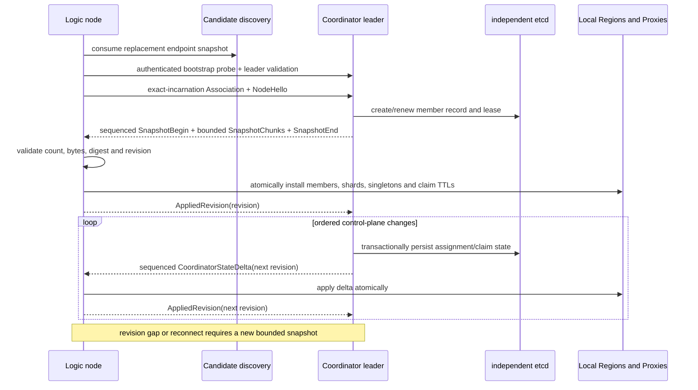

The session is node-level, not one registration loop per ShardRegion. One `NodeHello` advertises roles, capacity, hosted/proxied entity types, singleton eligibility/usage, node incarnation, and protocol fingerprints. Snapshot and delta content is filtered to the placement slices the node may host or has subscribed to route. A newly added Region/Proxy subscription installs its slice before becoming Ready.

Coordinator revision orders authoritative placement state; Association control sequence provides bounded retransmission across reconnect. Replaying either layer is idempotent. An unrecoverable control gap requests a fresh bounded snapshot rather than allowing partial routing state to become live.

### 4.4 First Message to an Unassigned Shard

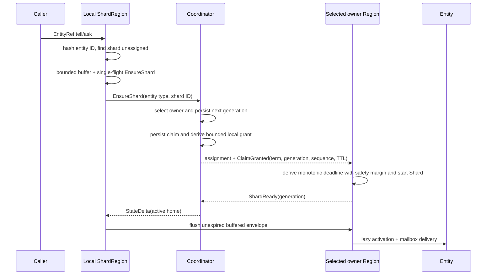

Concurrent callers for the same unknown shard share one resolution. Buffers are bounded by message count, bytes, and age; asks retain their original deadline.

### 4.5 Controlled Shard Handoff

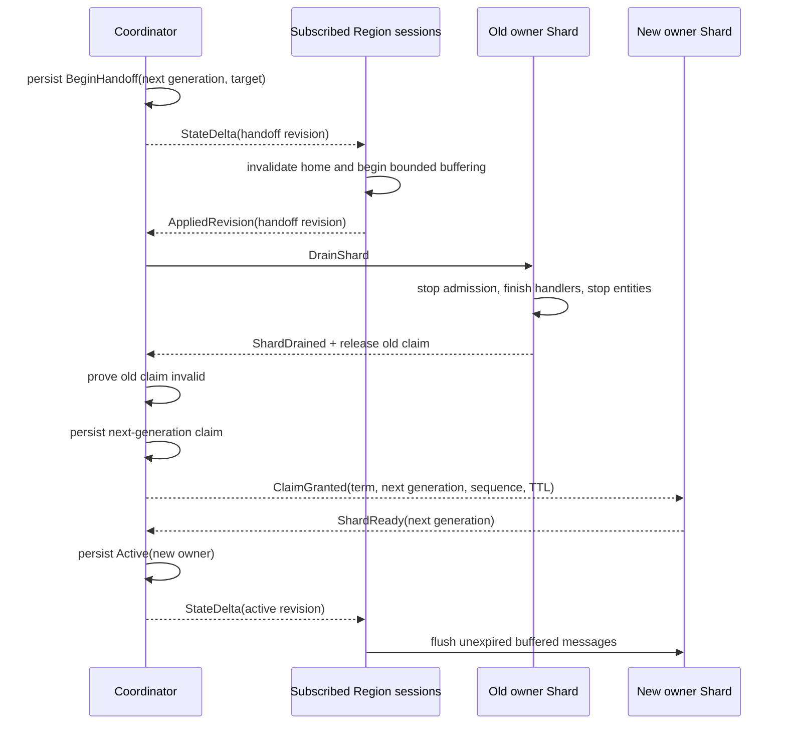

The Coordinator freezes the barrier from live sessions subscribed to the affected entity type: host and proxy Regions that may cache its shard home participate, while unrelated logic nodes cannot block the move. A node joining or adding the subscription during handoff installs the Handoff snapshot slice before routing. The revision barrier prevents participating Regions with a stale home from continuing to send tell messages to the old owner. Timeout alone is never proof that the old owner stopped; reassignment requires `ShardDrained` or independently proven claim/incarnation expiry.

### 4.6 Allocation and Rebalancing

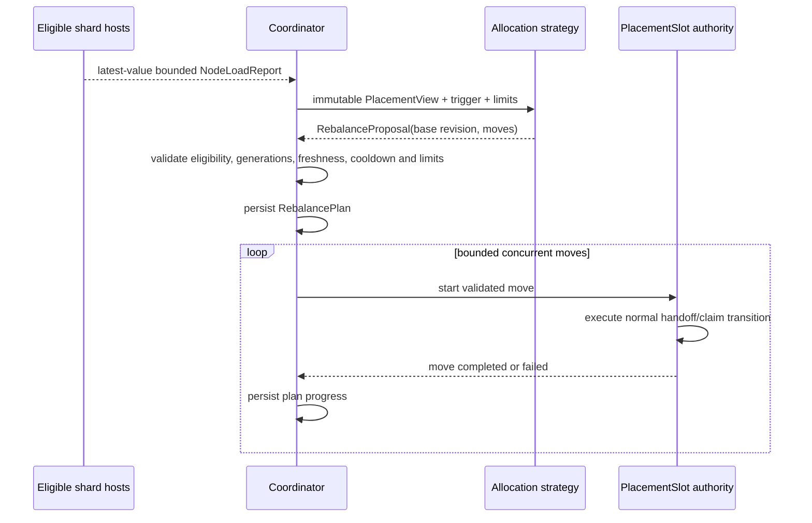

The strategy chooses proposals; it never grants authority. Initial allocation, failure recovery, drain, manual relocation, and automatic balancing are distinct reasons with priority `recovery > drain > manual > automatic`, but they converge on the same validated placement move and handoff state machine. The default `WeightedLeastLoad` strategy balances measured shard weight divided by configured node capacity, with deterministic tie-breaking, stale-sample rejection, hysteresis, minimum residence, node-join stability, cooldown, target-capacity reservations, and cluster/entity/source/target concurrency limits.

Automatic balancing runs only while the Coordinator is leader, Ready, claim-reconciled, and supplied with sufficiently fresh inputs. Active plans are persisted and recovered across leader failover. Singleton moves reuse the move executor for failure, drain, eligibility change, or manual relocation but are excluded from periodic load balancing.

## 5. Lifecycles

### 5.1 Logic Service Lifecycle

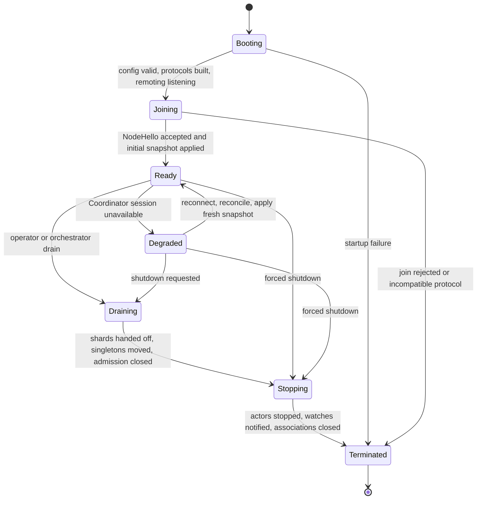

Lifecycle responsibilities:

| State | Allowed behavior |
|---|---|
| Booting | Load/validate configuration, identity, roles, protocols, codecs, TLS and resource limits |
| Joining | Accept only internal bootstrap/control traffic; establish Coordinator session and install snapshot |
| Ready | Admit configured external traffic and normal actor messages |
| Degraded | Continue known routes while local claim deadlines remain valid; stop new allocation/handoff/failover |
| Draining | Reject new external admission and placements; hand off shards/singletons; finish bounded work |
| Stopping | Fence claims, stop actors/children, complete pending asks, notify watches, cancel supervised tasks |
| Terminated | No actor path, node incarnation, association, claim, or background task remains live |

Claim expiry in `Degraded` fences only the affected Shard or SingletonManager. Concrete user actors may remain alive until service shutdown, but external readiness must reflect whether the node can still fulfill its declared roles.

### 5.2 Concrete User and Child Actor Lifecycle

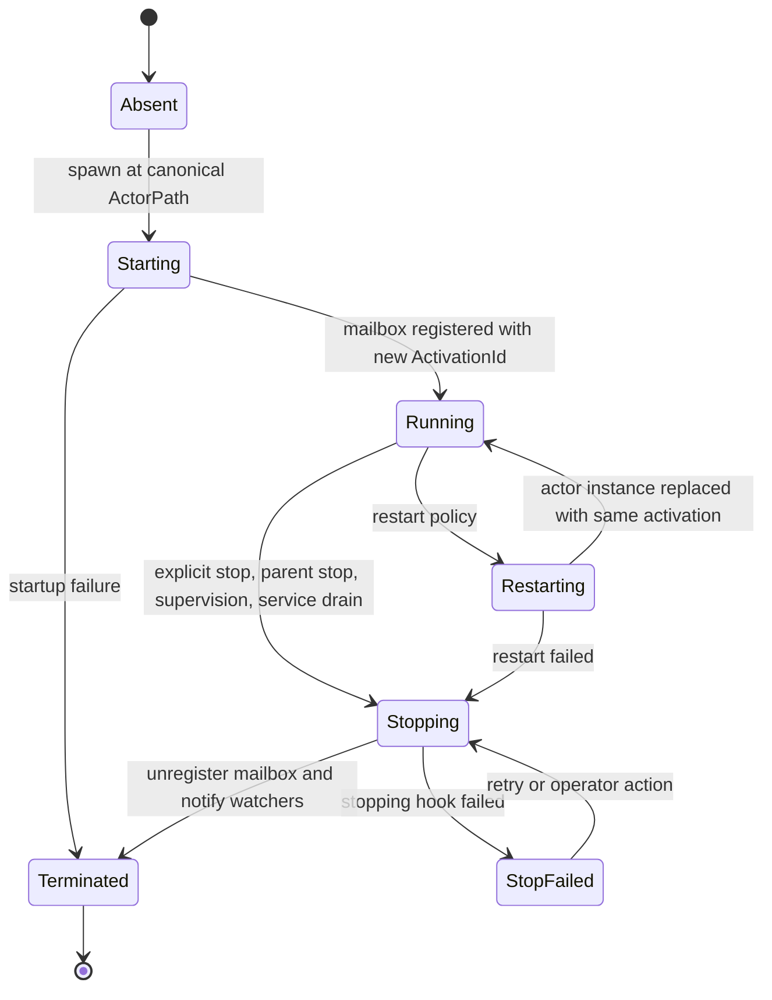

A supervision restart replaces the actor instance inside the same registered actor cell, preserving `ActorPath`, `ActivationId`, concrete `ActorRef`, mailbox, and watches. A full stop followed by a new spawn at the same path creates a new `ActivationId`; old references and watches never retarget. Stopping a parent recursively stops its children.

### 5.3 Sharded Entity Lifecycle

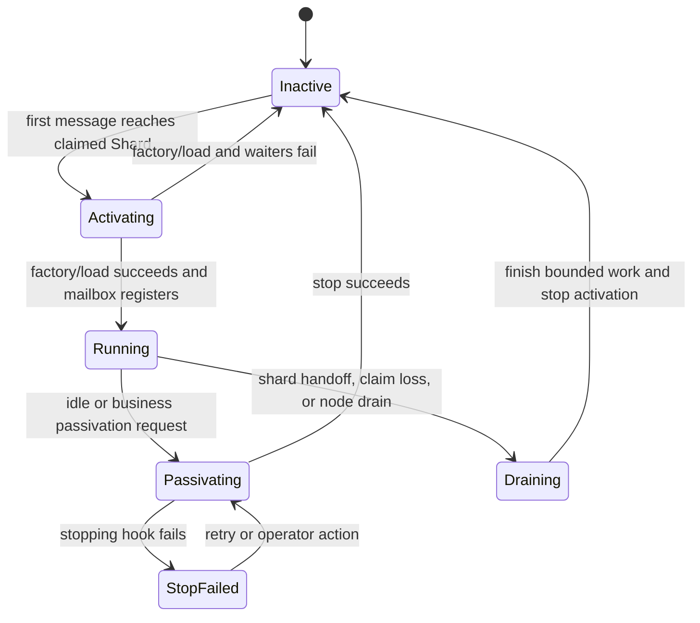

Passivation is local and does not modify shard placement or etcd. `EntityRef` remains valid while inactive and may activate a later instance; a concrete `ActorRef` to the old entity activation terminates.

The owning Shard has its own lifecycle:

```text
Unassigned -> Starting/claiming -> Active -> Handoff/draining -> Stopped
```

Only an Active Shard with a valid generation claim may load or invoke its entities.

### 5.4 Singleton Lifecycle

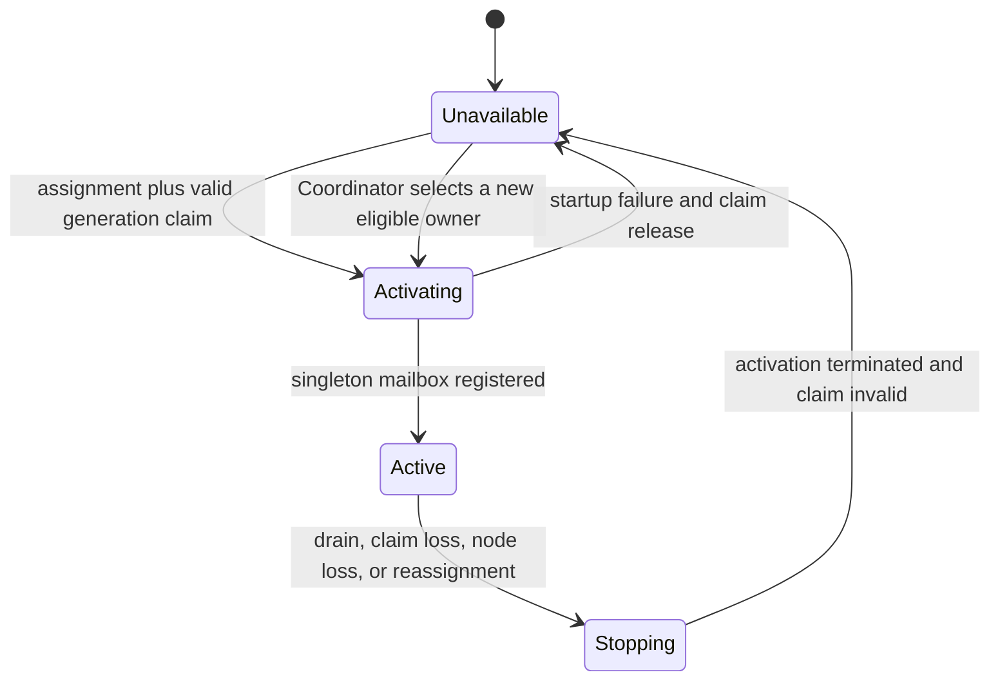

`SingletonRef` and its local proxy survive ordinary activation replacement. The old concrete singleton activation terminates before a new generation is published Active. Proxy buffering during the unavailable interval is bounded and respects ask deadlines.

### 5.5 Failure Ownership

| Failure | Component that reacts first | Required outcome |
|---|---|---|
| Handler error | Actor runtime/supervisor | Complete ask with failure or record tell failure; apply supervision policy |
| Mailbox or outbound queue full | Sender-side runtime | Reject admission explicitly; never grow an unbounded queue |
| Association control loss | Association supervisor | Stop all new data admission, fail queued unwritten work, reconnect with incarnation checks; do not immediately declare actor death |
| Coordinator session loss | Service supervisor | Enter Degraded; preserve known routes only until claim deadlines |
| Shard/singleton claim loss | Local Shard or SingletonManager | Fence admission before best-effort stop; stopping failure cannot preserve authority |
| Node incarnation declared dead | Coordinator and DeathWatch | Invalidate routes/claims and terminate watches bound to that incarnation |
| etcd unavailable | Coordinator | Stop new decisions; preserve no authority beyond existing bounded leases/terms |
| Allocation strategy/load input failure | Coordinator rebalancer | Reject the proposal or skip the round; never partially mutate placement |
| Rebalance move failure | Coordinator and PlacementSlot authority | Persist progress, preserve fencing, then complete/recover forward or fail visibly; never roll back to ambiguous dual ownership |

## 6. Core Invariants

```text
ActorRef identifies an exact activation, not merely a reusable path.
EntityRef and SingletonRef identify logical destinations and survive reactivation.
Concrete actor replacement never makes a stale ActorRef valid again.
DeathWatch always binds one exact ActivationId; logical refs never create an actor merely to watch it.
Remote messages are delivered through the same mailbox and Handler<M> path as local messages.
Tell is at-most-once; ask has a deadline and may end with UnknownResult.
ProtocolId and message IDs are explicit; fingerprints cover codec/schema versions and are negotiated per Association.
Transport and business-protocol compatibility are separate: one mismatched ProtocolId cannot close an otherwise compatible Association.
Every queue and temporary buffer is bounded.
Only a valid claim holder may serve a shard or singleton generation.
Shard and Singleton use one placement-slot authority engine for generation, claim, drain, and fencing while retaining distinct routing and lifecycle semantics.
Allocation/rebalance strategies return proposals only; the Coordinator revalidates and persists every move before the existing handoff/claim state machine changes authority.
Automatic rebalance is bounded by freshness, hysteresis, cooldown, minimum residence and concurrency limits, and stops while Coordinator state is degraded or unreconciled.
Control commands use bounded sequenced delivery plus idempotent reconciliation; business tell/ask frames are never replayed by that mechanism.
Control-connection loss stops new Association data admission in v1.
Known shard routes continue during temporary Coordinator loss while their claims remain valid.
Unknown placement cannot be invented during Coordinator loss.
etcd is control-plane storage, never a per-message routing database.
```

## 7. Workspace Boundaries

```text
lattice-core
  ids, paths, ActorRef/EntityRef/SingletonRef values, envelopes, errors

lattice-actor
  Actor, Handler<M>, ActorContext, mailboxes, supervision, lifecycle, local registry

lattice-remoting
  codec registry, wire frames, TCP/TLS associations, tell/ask/watch transport

lattice-placement
  Coordinator protocol, etcd metadata, membership, shards, claims, singletons

lattice-service
  process assembly, ShardRegions, SingletonProxies, drain and shutdown

lattice-codegen
  actor_protocol! macro and optional business-catalogue/Gateway generators; no generated gRPC clients

lattice-sim (test support, not production API)
  deterministic clock/network/etcd/process simulation, trace journal and invariant checking

lattice-eventbus / lattice-scheduler / lattice-config / lattice-gateway / lattice-ops
  focused integration and operational concerns
```

`lattice-rpc` and the public Direct Link API were migration sources and are absent after the completed
full-stop protocol cutover. `etcd-client` may still carry its own transitive tonic implementation;
lattice exposes no framework gRPC service or business transport through it.

## 8. Verification Architecture

Distributed correctness is tested at four layers: pure state-machine reducers, deterministic seeded cluster simulation, real Docker multi-process/TCP/TLS/etcd scenarios, and chaos/soak runs. Authoritative control components expose explicit state/event/effect transitions so production executors and the simulator share one transition algorithm.

The Logic service lifecycle is one of those production reducers. Service start/shutdown executes its
`Booting -> Joining -> Ready/Degraded -> Draining/Stopping -> Terminated` transitions, and
`lattice-sim::ServiceLifecycleAdapter` invokes that same reducer rather than a test-only model.

The test oracle checks ownership, generation, lifecycle, ordering and resource invariants after every simulated transition. Real scenarios use structured readiness/admin/trace state rather than fixed sleeps or human log parsing. Every randomized failure records a replay seed and causal trace.

Correctness is simulation-first; real integration and final acceptance are Docker-based. Host machines and CI workers require Docker with Compose support but no local Rust, etcd, TLS or fault-injection toolchain. Pinned runner/dependency images, isolated networks, disposable volumes, artifact collection and cleanup rules are defined in [08-distributed-testing.md](08-distributed-testing.md).
